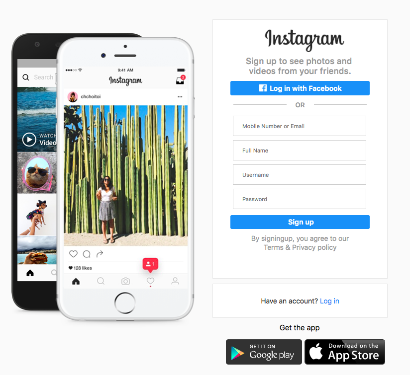
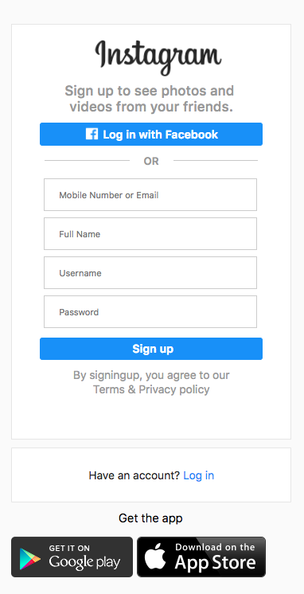

## Instragram Homework

### Task summary 
Make a __reponsive webpage__ using HTML and CSS of the Instagram homepage. 

#### Result 
* Overview

* Reponsiveness

#### Responsiveness

The responsive css is design to get rid of the phone asset on the left of the page and for a maximum width of 600px, using css @media queries. The result is as shown on the above picture. 

